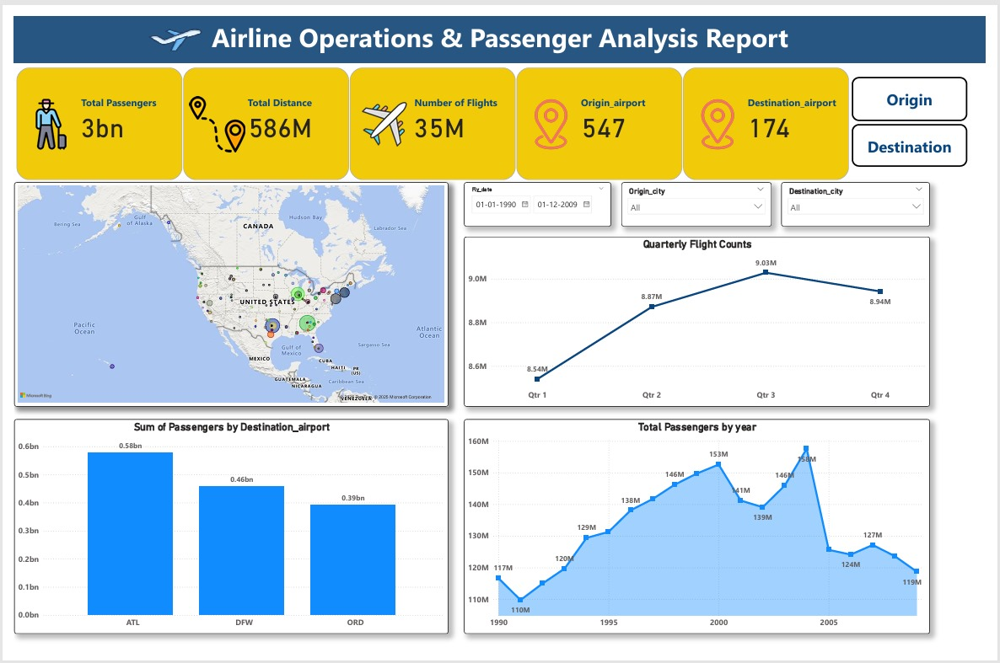

# ✈️ Airport Analysis SQL Project

This project showcases a full data analysis pipeline on airport-related data using **SQL**, **Python (Jupyter + Dash)**, and **Power BI**. It includes solving 20 business problem statements, building interactive visualizations, and delivering insights through a structured dashboard and documentation.

---

## 📁 Folder Structure

```

AirportAnalysisSQLProject/
├── 📂 SQL/ # 20 SQL queries for airport data analysis
├── 📂 Python_notebook/ # Python dashboard with Jupyter & Dash
├── 📂 Dashboard/ # Power BI dashboard (.pbix)
├── 📂 Documentation/ #PDF report with problem statements
├── 📂 DashboardImage/ #Power BI screenshot (dashboard preview)
└── 📄 README.md #Project overview
``` 


---
## 🧠 Project Overview

This project focuses on analyzing airport data to derive meaningful insights about:

- Passenger traffic trends
- Delays and scheduling patterns
- Airport performance metrics
- Peak travel times
- And much more...

---

## 🧰 Tools & Technologies Used

- **SQL (MySQL/PostgreSQL)** – To query and analyze structured data
- **Python (Jupyter + Dash)** – For data wrangling and interactive charts
- **Power BI** – To build a professional dashboard
- **Pandas, Plotly, Seaborn** – For data manipulation and visualization
- **Git & GitHub** – For version control and sharing

---

## 📂 Dataset

The dataset used in this project is approximately **500 MB** and is **not included in this GitHub repository** due to size limitations.

🔗 [Download Dataset from Google Drive](https://drive.google.com/file/d/1Mk00QddbF8oExiPN0MSVEr58d0NN9s3w/view?usp=drivesdk)  


After downloading, place the file in a new folder:


---

## 🧮 SQL Analysis

- The `SQL/` folder contains a single SQL script with **20 problem statements**, each designed to extract meaningful insights from the dataset.
- These include:
  - Top airports by traffic
  - Average delays
  - Monthly trends
  - Destination pair analysis
- Each query is labeled and optimized.

---

## 🐍 Python Visualization (Jupyter + Dash)

### 📘 Jupyter Notebook
- Used for data cleaning, exploration, and static visualizations
- Charts built using **Matplotlib**, **Seaborn**, and **Plotly**

### 🌐 Dash Application
- Built an **interactive dashboard using Plotly Dash**
- Features include:
  - `@app.callback()` decorators for interactivity
  - `Input()` and `Output()` components for dynamic chart updates
  - Dash layout using `html.Div`, `dcc.Graph`, `dcc.Dropdown`, etc.
- Users can interact with:
  - Dropdowns
  - Text inputs
  - Time sliders
- This transforms raw analysis into a **live web-based dashboard**

> ✅ Demonstrates end-to-end Python dashboard development with interactivity

---

## 📊 Power BI Dashboard

- The `Dashboard/` folder contains a `.pbix` file that presents insights through:
  - Bar and line charts
  - Slicers and filters
  - Aggregated airport statistics
- Designed for stakeholders who prefer a no-code, drag-and-drop dashboard

---

## 📊 Power BI Dashboard Preview




---

## 📄 Documentation

- Located in the `Documentation/` folder
- PDF report contains:
  - All 20 problem statements
  - Their SQL solutions
  - Business questions
  - Overall storyline and analytical approach
- Serves as a project report for presentations or interviews

---

## 🚀 How to Run This Project

1. **Download the dataset** from the link above and place it in the `Dataset/` folder.
2. Run the SQL file in your preferred SQL environment (e.g., MySQL Workbench, pgAdmin).
3. Open and execute the Jupyter Notebook from the `Python_notebook/` folder.
4. Launch the Dash app (if available) using:
   ```bash
   python app.py

